# 🚀 Membangun Aplikasi Web dengan FastAPI, Jinja2, dan Docker

Tutorial ini akan membawa Anda melalui langkah-langkah untuk membuat aplikasi **FastAPI** dengan **web interface** menggunakan **Jinja2** dan menjalankannya di dalam **Docker container**. Anda akan belajar bagaimana membuat halaman web menggunakan template HTML, merender halaman dengan FastAPI, dan mengemas aplikasi menggunakan Docker.

---

### 📁 Langkah 1: Membuat Folder Proyek

1. **Buka terminal** dan buat folder untuk proyek FastAPI Anda:

   ```bash
   mkdir tugas-docker
   cd tugas-docker
   ```

2. **Verifikasi folder telah dibuat**:

   ```bash
   ls
   ```

   Gambar folder yang dibuat:
   
   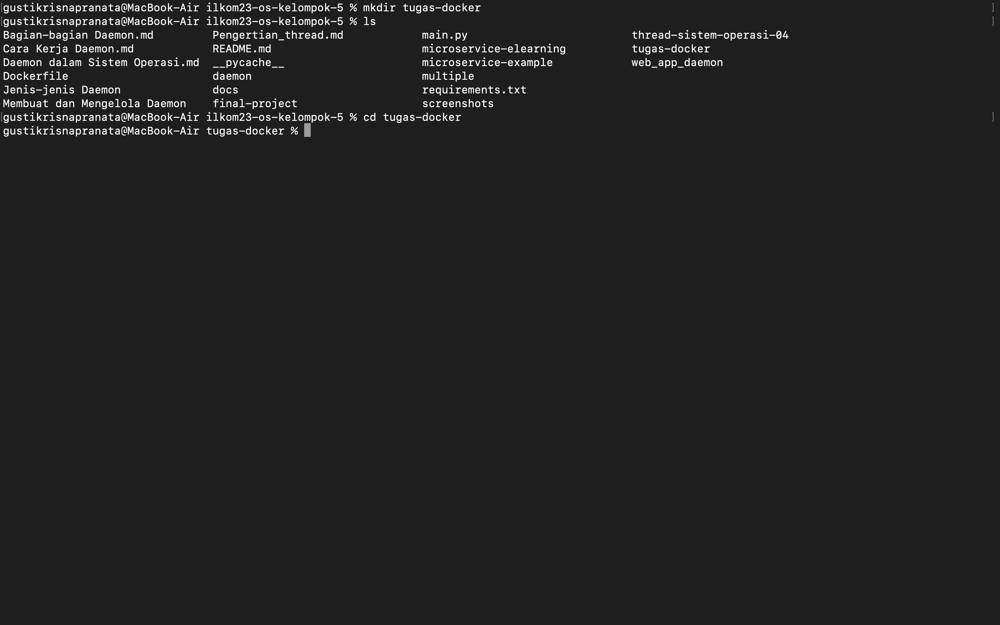

---

### 📝 Langkah 2: Membuat File `main.py`

1. **Buka terminal** dan buat file `main.py` menggunakan **nano**:

   ```bash
   nano main.py
   ```

2. **Buka `main.py`** dan tambahkan kode berikut untuk menginisialisasi aplikasi FastAPI serta menyiapkan halaman web menggunakan **Jinja2**:

   ```python
   from fastapi import FastAPI
   from fastapi.templating import Jinja2Templates
   from starlette.responses import HTMLResponse
   from starlette.requests import Request

   # Inisialisasi FastAPI dan Jinja2Templates
   app = FastAPI()
   templates = Jinja2Templates(directory="templates")

   # Endpoint untuk halaman utama (Home)
   @app.get("/", response_class=HTMLResponse)
   def read_root(request: Request):
       return templates.TemplateResponse("home.html", {"request": request})

   # Endpoint untuk halaman about
   @app.get("/about", response_class=HTMLResponse)
   def about(request: Request):
       return templates.TemplateResponse("about.html", {"request": request})
   ```

3. **Simpan dan keluar** dari **nano**:
   - Tekan `Ctrl + O` untuk menyimpan file.
   - Tekan `Enter` untuk mengonfirmasi nama file.
   - Tekan `Ctrl + X` untuk keluar dari **nano**.

   Gambar kode dalam `main.py` yang dibuka dengan nano:
   
   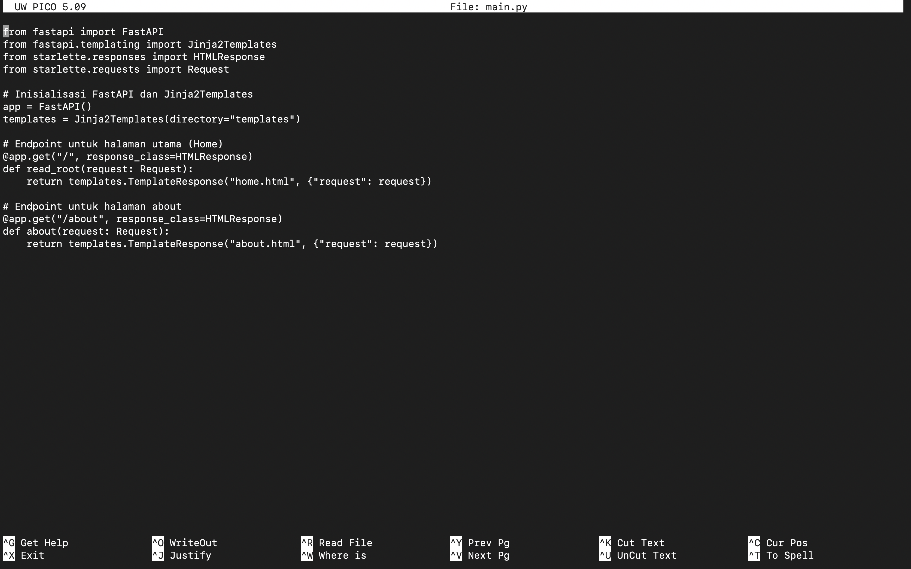
   
---

### 🌐 Langkah 3: Menyiapkan Struktur Folder Template

1. **Buat folder `templates/`** untuk menyimpan file HTML:

   ```bash
   mkdir templates
   ```

2. **Buat file `home.html`** di dalam folder `templates/`:

   ```bash
   touch templates/home.html
   ```

3. **Buka file `home.html`** dengan **nano** untuk mengeditnya:

   ```bash
   nano templates/home.html
   ```
4. **Isi `home.html`** dengan HTML berikut:

   ```html
   <!DOCTYPE html>
   <html lang="en">
   <head>
       <meta charset="UTF-8">
       <meta name="viewport" content="width=device-width, initial-scale=1.0">
       <title>Welcome to FastAPI Web</title>
       <style>
           body {
               font-family: Arial, sans-serif;
               text-align: center;
               margin-top: 50px;
           }
           h1 {
               color: #3498db;
           }
           p {
               font-size: 18px;
           }
       </style>
   </head>
   <body>
       <h1>Welcome to FastAPI Web!</h1>
       <p>This is a simple web app served by FastAPI.</p>
       <a href="/about">Go to About Page</a>
   </body>
   </html>
   ```
5. **Simpan dan keluar** dari **nano**:
   - Tekan `Ctrl + O` untuk menyimpan file.
   - Tekan `Enter` untuk mengonfirmasi nama file.
   - Tekan `Ctrl + X` untuk keluar dari **nano**.

   Gambar file `home.html` setelah selesai diubah:

   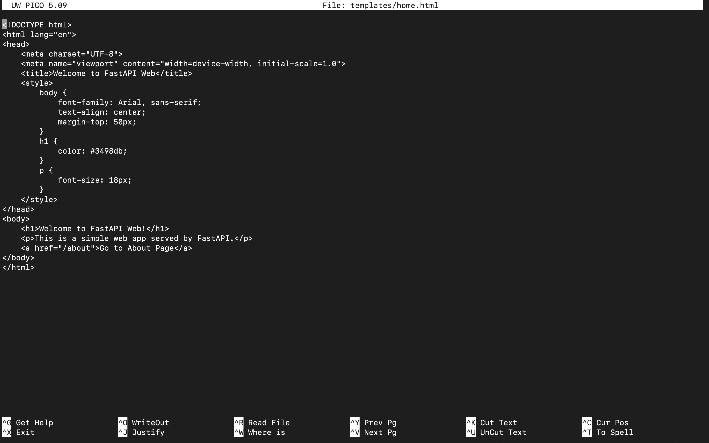

6. **Buat file `about.html`** untuk halaman "About" di dalam folder `templates/`:

   ```bash
   touch templates/about.html
   ```

7. **Buka file `about.html`** dengan **nano** untuk mengeditnya:

   ```bash
   nano templates/about.html
   ```

8. **Isi `about.html`** dengan HTML berikut:

   ```html
   <!DOCTYPE html>
   <html lang="en">
   <head>
       <meta charset="UTF-8">
       <meta name="viewport" content="width=device-width, initial-scale=1.0">
       <title>About - FastAPI Web</title>
       <style>
           body {
               font-family: Arial, sans-serif;
               text-align: center;
               margin-top: 50px;
           }
           h1 {
               color: #e74c3c;
           }
           p {
               font-size: 18px;
           }
       </style>
   </head>
   <body>
       <h1>About This FastAPI Web App</h1>
       <p>This web app is created using FastAPI and serves dynamic HTML pages with Jinja2 templates.</p>
       <a href="/">Go to Home Page</a>
   </body>
   </html>
   ```

9. **Simpan dan keluar** dari **nano**.

   Gambar file `about.html` setelah selesai diubah:

   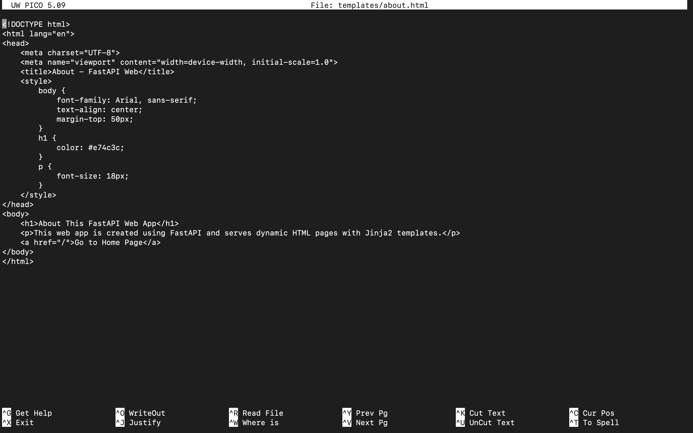

Dengan langkah ini, Anda telah berhasil menyiapkan folder `templates/` dan membuat file template HTML untuk halaman utama dan halaman about. Anda sekarang siap untuk menjalankan aplikasi FastAPI!

---

### 🚀 Langkah 4: Menjalankan Aplikasi FastAPI

1. **Install FastAPI, Uvicorn, dan Jinja2**:

   ```bash
   pip install fastapi uvicorn jinja2
   ```

   Gambar instalasi dependensi:
   
   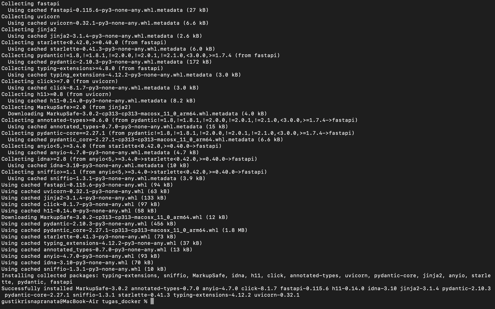

2. **Jalankan aplikasi FastAPI** dengan perintah berikut:

   ```bash
   uvicorn main:app --reload
   ```

   Gambar aplikasi berjalan:
   
   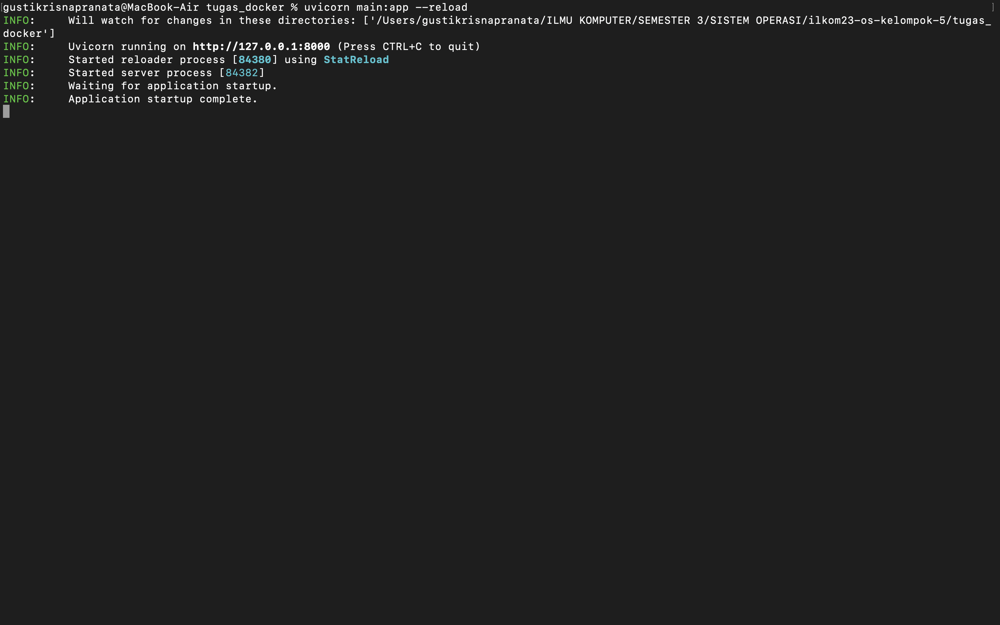

---

### 🌐 Langkah 5: Akses Aplikasi di Browser

1. **Buka browser** dan akses aplikasi di alamat berikut:

   - **Halaman Utama**:
     ```text
     http://127.0.0.1:8000/
     ```

     Gambar halaman utama di browser:
     
     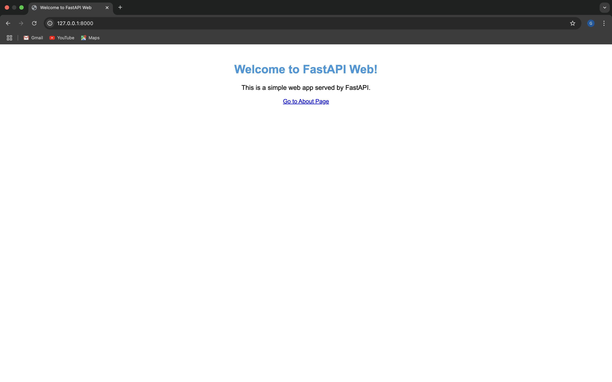

   - **Halaman About**:
     ```text
     http://127.0.0.1:8000/about
     ```

     Gambar halaman about di browser:
     
     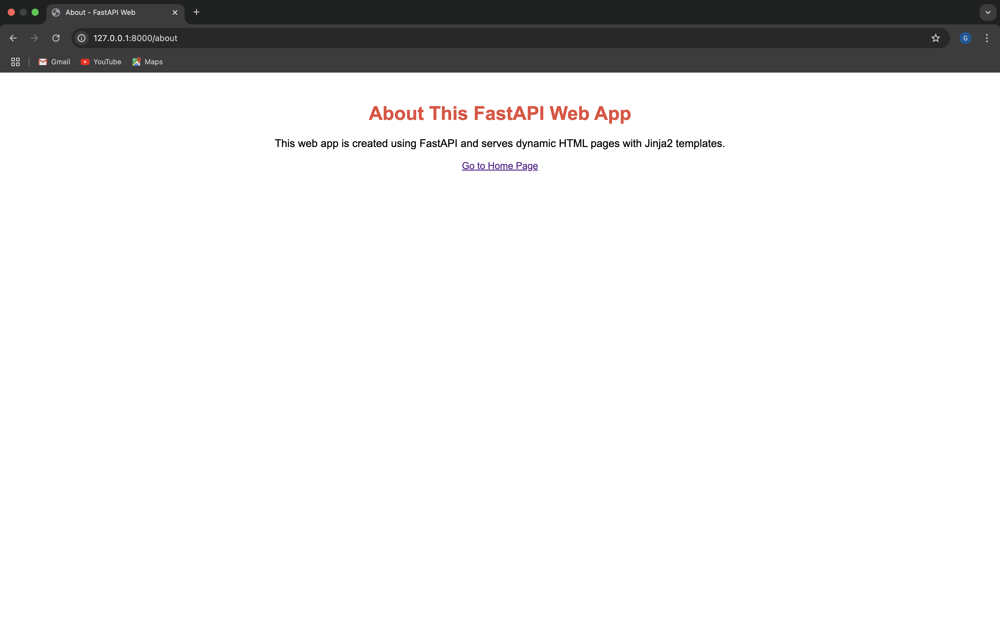

---

### 🐳 Langkah 6: Menambahkan Docker untuk Menjalankan Aplikasi

1. **Buat file `Dockerfile`** untuk aplikasi FastAPI:

   ```bash
   touch Dockerfile
   ```

2. **Buka file `Dockerfile`** dengan **nano**:

   ```bash
   nano Dockerfile
   ```

3. **Isi `Dockerfile`** dengan kode berikut:

   ```dockerfile
   FROM python:3.9

   WORKDIR /app

   COPY . .

   RUN pip install --no-cache-dir -r requirements.txt

   CMD ["uvicorn", "main:app", "--host", "0.0.0.0", "--port", "8000"]
   ```

4. **Simpan dan keluar** dari **nano**:
   - Tekan `Ctrl + O` untuk menyimpan file.
   - Tekan `Enter` untuk mengonfirmasi nama file.
   - Tekan `Ctrl + X` untuk keluar dari **nano**.

   Gambar `Dockerfile` setelah selesai:

   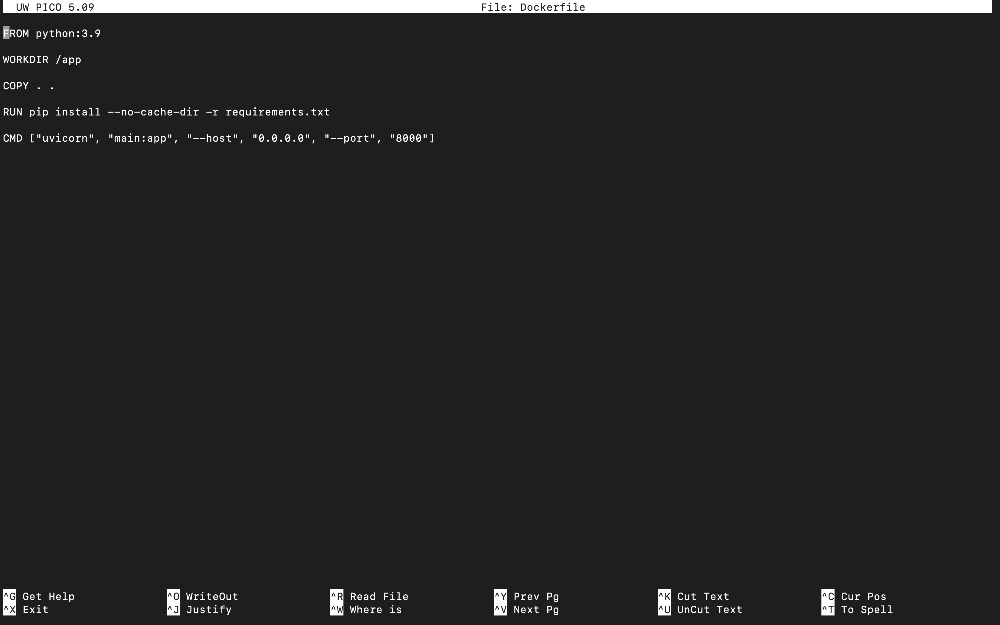

5. **Buat file `requirements.txt`** untuk menyimpan dependensi aplikasi:

   ```bash
   touch requirements.txt
   ```

6. **Buka file `requirements.txt`** dengan **nano**:

   ```bash
   nano requirements.txt
   ```

7. **Isi `requirements.txt`** dengan dependensi yang diperlukan:

   ```txt
   fastapi
   uvicorn
   jinja2
   ```

8. **Simpan dan keluar** dari **nano**:
   - Tekan `Ctrl + O` untuk menyimpan file.
   - Tekan `Enter` untuk mengonfirmasi nama file.
   - Tekan `Ctrl + X` untuk keluar dari **nano**.

   Gambar `requirements.txt` setelah selesai:

   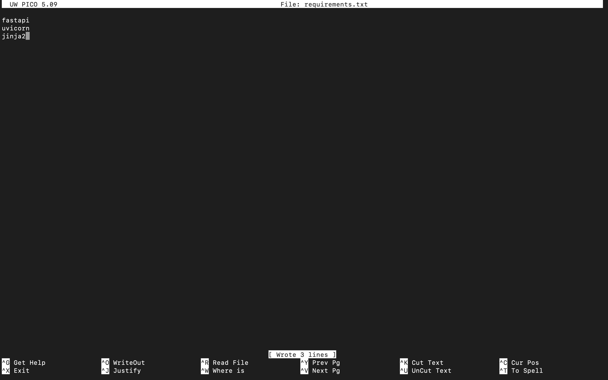

Dengan langkah ini, Anda telah berhasil menambahkan Dockerfile dan file `requirements.txt` yang diperlukan untuk menjalankan aplikasi FastAPI di dalam container Docker. Anda kini dapat melanjutkan dengan membangun dan menjalankan Docker container untuk aplikasi Anda!

---

### 📦 Langkah 7: Membangun Docker Image dan Menjalankan Container

1. **Bangun Docker image**:

   ```bash
   docker build -t fastapi-web-app .
   ```

   Gambar proses build Docker:
   
   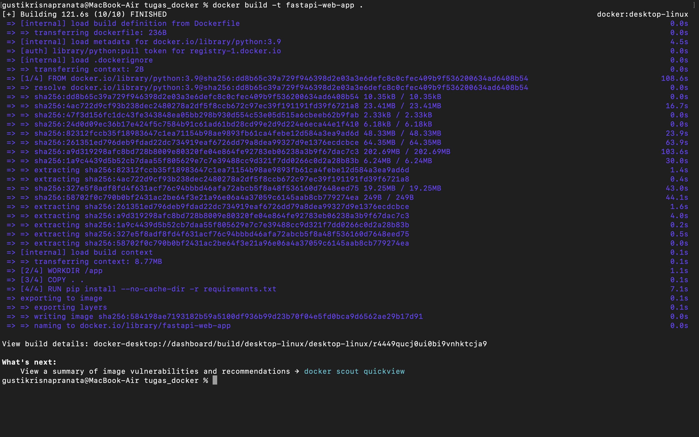

2. **Jalankan Docker container**:

   ```bash
   docker run -d -p 8000:8000 fastapi-web-app
   ```

   Gambar Docker container berjalan:
   
   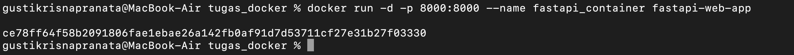

---

### 🌍 Langkah 8: Akses Aplikasi melalui Docker

1. **Buka browser** dan akses aplikasi yang berjalan di Docker di alamat berikut:

   ```text
   http://127.0.0.1:8000
   ```

   Gambar tampilan aplikasi di browser (dari Docker):
   
   

---

## 🎉 Selesai!

Selamat! Anda telah berhasil membuat aplikasi **FastAPI** dengan **web interface** menggunakan **Jinja2** dan menjalankannya di dalam **Docker container**. Anda sekarang dapat mengembangkan aplikasi lebih lanjut dengan menambahkan lebih banyak fitur atau tampilan sesuai kebutuhan.

---

Berikut adalah lanjutan dari tutorial Anda dengan langkah-langkah terkait **Bedah Container**, serta **Optimasi Resources** dalam konteks aplikasi FastAPI yang berjalan dalam container Docker. Semua proses dilakukan melalui terminal, dan saya akan sertakan instruksi terkait screenshot pada setiap langkah.


# 📚 Tutorial: Bedah Container dan Optimasi Resources pada Docker untuk Aplikasi FastAPI

---

## 🔍 Langkah 1: Melihat Container yang Berjalan

Setelah Anda berhasil menjalankan aplikasi FastAPI dalam container, pastikan container berjalan dengan baik menggunakan perintah berikut:

```bash
docker ps
```

Perintah ini akan menampilkan daftar container yang sedang berjalan, termasuk informasi seperti container ID, nama, port mapping, dan lainnya.

Output yang diharapkan akan terlihat seperti ini:

Gambar output `docker ps`:
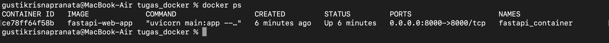

---

## 🛠️ Langkah 2: Mengakses Shell di dalam Container

Untuk melihat lebih dalam tentang container Anda, gunakan perintah berikut untuk masuk ke dalam shell container:

```bash
docker exec -it fastapi_container /bin/bash
```

Setelah perintah ini, Anda akan masuk ke dalam shell container bernama `fastapi_container`. Anda dapat menjalankan perintah shell seperti biasa di dalam container.

Gambar tampilan shell dalam container:
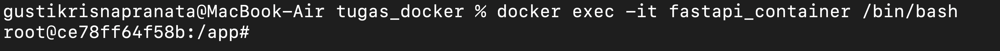

---

## 🗂️ Langkah 3: Bedah Struktur File dalam Container

Berikut adalah enam perintah penting yang dapat Anda gunakan untuk mengeksplorasi struktur dan isi container:

### **1. Menampilkan Struktur Direktori Root**

Gunakan perintah ini untuk melihat semua file dan direktori di direktori root container:

```bash
ls -lah /
```

Output ini akan membantu Anda memahami struktur direktori utama dalam container.

Gambar hasil perintah `ls -lah /`:


---

### **2. Memeriksa Informasi Sistem Operasi**

Untuk melihat detail tentang sistem operasi yang digunakan dalam container:

```bash
cat /etc/os-release
```

Output akan menunjukkan nama OS, versinya, dan detail lainnya.

Gambar output `cat /etc/os-release`:
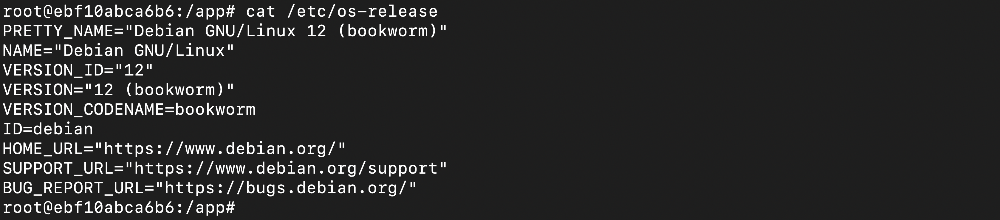

---

### **3. Melihat File Log Aplikasi**

Jika aplikasi Anda mencatat log, Anda dapat memeriksa file lognya dengan:

```bash
cat /app/logs/app.log
```

Log akan memberikan wawasan tentang aktivitas aplikasi Anda.

---

### **4. Melihat Proses yang Sedang Berjalan**

Untuk melihat proses yang sedang berjalan secara real-time dalam container, gunakan:

```bash
top
```

Anda juga dapat menggunakan perintah `ps aux` untuk daftar proses statis:

```bash
ps aux
```

Gambar daftar proses:
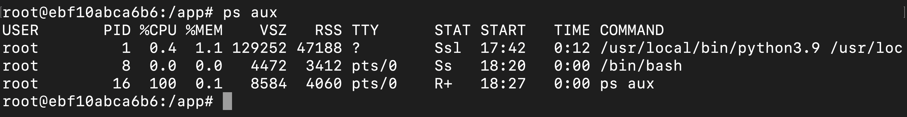

---

### **5. Memeriksa Penggunaan Disk**

Untuk melihat kapasitas dan penggunaan disk pada container, jalankan:

```bash
df -h
```

Output akan menunjukkan setiap mount point dalam container dan ruang yang digunakan.

---

### **6. Memeriksa Penggunaan Memori**

Untuk melihat penggunaan memori dalam container:

```bash
free -m
```

Output ini akan membantu Anda memantau penggunaan memori dan mengetahui apakah container membutuhkan optimasi lebih lanjut.

Gambar hasil `free -m`:


---

## ⚙️ Langkah 4: Monitoring Resource Container

### **1. Memantau Resource secara Real-Time**

Gunakan perintah berikut untuk melihat penggunaan resource seperti CPU, memori, jaringan, dan disk oleh container Anda:

```bash
docker stats fastapi_container
```

Output ini memberikan gambaran real-time penggunaan resource container, seperti:

- **CPU Usage (%)**: Persentase CPU yang digunakan oleh container.
- **Memory Usage**: Jumlah memori yang digunakan dibandingkan dengan batas memori.
- **Network I/O**: Data yang masuk dan keluar melalui jaringan.
- **Block I/O**: Aktivitas baca/tulis ke disk.

Gambar output `docker stats`:
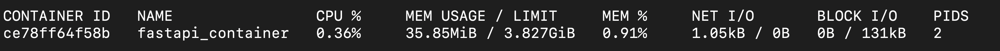

---

## ⚡ Langkah 5: Optimasi Resources untuk Container

### **1. Membatasi Memori**

Untuk menghindari container menggunakan terlalu banyak memori, batasi penggunaan memori container dengan perintah berikut:

```bash
docker run -d -p 8000:8000 --memory="512m" --name fastapi_container_memory fastapi-web-app
```

Perintah ini membatasi container agar hanya menggunakan memori hingga 512 MB.

---

### **2. Membatasi CPU**

Untuk membatasi penggunaan CPU container, gunakan opsi berikut:

```bash
docker run -d -p 8000:8000 --cpus="1.0" --name fastapi_container_cpu fastapi-web-app
```

Perintah ini membatasi penggunaan CPU hingga satu core.

---

### **3. Kombinasi Batasan CPU dan Memori**

Untuk kombinasi batasan CPU dan memori, gunakan perintah berikut:

```bash
docker run -d -p 8000:8000 --cpus="1.0" --memory="512m" --name fastapi_container_optimized fastapi-web-app
```

Perintah ini mengoptimasi container untuk menggunakan CPU maksimum satu core dan memori maksimum 512 MB.

---

## 🎉 Selesai!

Anda telah berhasil mempelajari cara membedah container, memahami struktur file di dalamnya, memantau resource, serta melakukan optimasi penggunaan resource untuk aplikasi FastAPI di Docker. Tutorial ini dapat membantu meningkatkan efisiensi aplikasi Anda, terutama ketika menjalankannya di lingkungan yang terbatas. Selamat mencoba! 🚀
```
