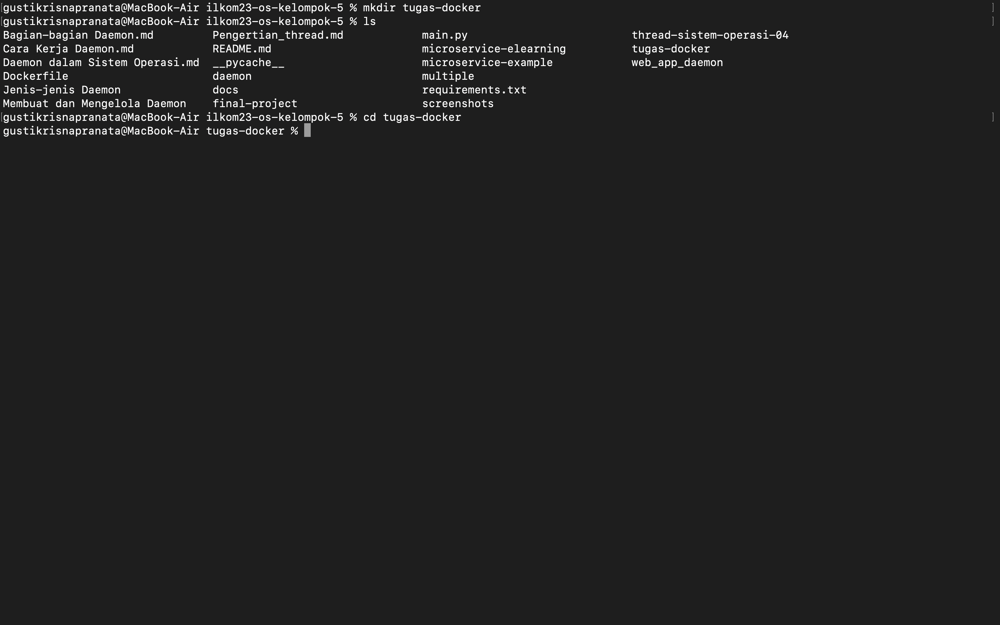
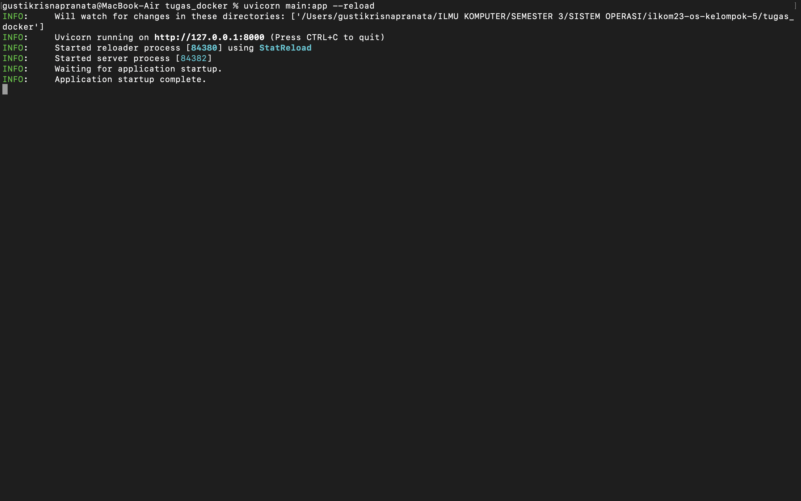
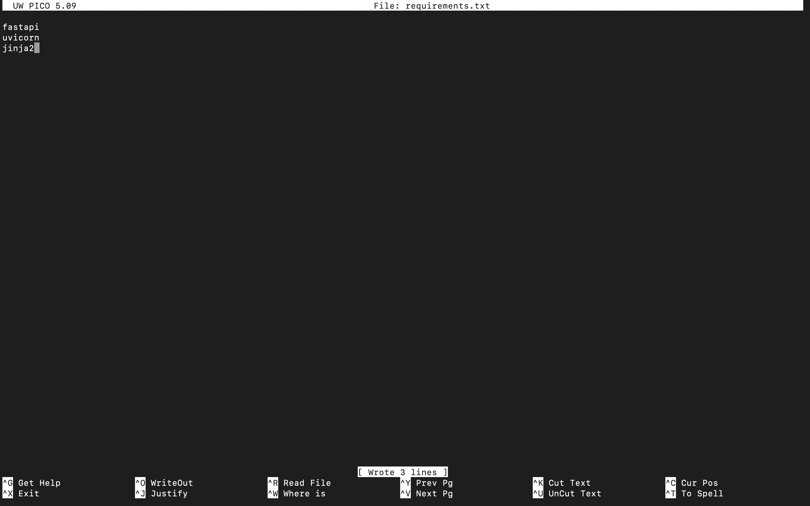

# 🚀 Tutorial: Membuat Aplikasi FastAPI dengan Web Interface dan Docker

Tutorial ini akan membawa Anda melalui langkah-langkah untuk membuat aplikasi **FastAPI** dengan **web interface** menggunakan **Jinja2** dan menjalankannya di dalam **Docker container**. Anda akan belajar bagaimana membuat halaman web menggunakan template HTML, merender halaman dengan FastAPI, dan mengemas aplikasi menggunakan Docker.

---

### 📁 Langkah 1: Membuat Folder Proyek

1. **Buka terminal** dan buat folder untuk proyek FastAPI Anda:

   ```bash
   mkdir tugas-docker
   cd tugas-docker
   ```

2. **Verifikasi folder telah dibuat**:

   ```bash
   ls
   ```

   Gambar folder yang dibuat:
   
   

---

### 📝 Langkah 2: Membuat File `main.py`

1. **Buka terminal** dan buat file `main.py` menggunakan **nano**:

   ```bash
   nano main.py
   ```

2. **Buka `main.py`** dan tambahkan kode berikut untuk menginisialisasi aplikasi FastAPI serta menyiapkan halaman web menggunakan **Jinja2**:

   ```python
   from fastapi import FastAPI
   from fastapi.templating import Jinja2Templates
   from starlette.responses import HTMLResponse
   from starlette.requests import Request

   # Inisialisasi FastAPI dan Jinja2Templates
   app = FastAPI()
   templates = Jinja2Templates(directory="templates")

   # Endpoint untuk halaman utama (Home)
   @app.get("/", response_class=HTMLResponse)
   def read_root(request: Request):
       return templates.TemplateResponse("home.html", {"request": request})

   # Endpoint untuk halaman about
   @app.get("/about", response_class=HTMLResponse)
   def about(request: Request):
       return templates.TemplateResponse("about.html", {"request": request})
   ```

3. **Simpan dan keluar** dari **nano**:
   - Tekan `Ctrl + O` untuk menyimpan file.
   - Tekan `Enter` untuk mengonfirmasi nama file.
   - Tekan `Ctrl + X` untuk keluar dari **nano**.

   Gambar kode dalam `main.py` yang dibuka dengan nano:
   
   
   
---

### 🌐 Langkah 3: Menyiapkan Struktur Folder Template

1. **Buat folder `templates/`** untuk menyimpan file HTML:

   ```bash
   mkdir templates
   ```

2. **Buat file `home.html`** di dalam folder `templates/`:

   ```bash
   touch templates/home.html
   ```

3. **Buka file `home.html`** dengan **nano** untuk mengeditnya:

   ```bash
   nano templates/home.html
   ```

4. **Isi `home.html`** dengan HTML berikut:

   ```html
   <!DOCTYPE html>
   <html lang="en">
   <head>
       <meta charset="UTF-8">
       <meta name="viewport" content="width=device-width, initial-scale=1.0">
       <title>Welcome to FastAPI Web</title>
       <style>
           body {
               font-family: Arial, sans-serif;
               text-align: center;
               margin-top: 50px;
           }
           h1 {
               color: #3498db;
           }
           p {
               font-size: 18px;
           }
       </style>
   </head>
   <body>
       <h1>Welcome to FastAPI Web!</h1>
       <p>This is a simple web app served by FastAPI.</p>
       <a href="/about">Go to About Page</a>
   </body>
   </html>
   ```

5. **Simpan dan keluar** dari **nano**:
   - Tekan `Ctrl + O` untuk menyimpan file.
   - Tekan `Enter` untuk mengonfirmasi nama file.
   - Tekan `Ctrl + X` untuk keluar dari **nano**.

   Gambar file `home.html` setelah selesai diubah:

   

6. **Buat file `about.html`** untuk halaman "About" di dalam folder `templates/`:

   ```bash
   touch templates/about.html
   ```

7. **Buka file `about.html`** dengan **nano** untuk mengeditnya:

   ```bash
   nano templates/about.html
   ```

8. **Isi `about.html`** dengan HTML berikut:

   ```html
   <!DOCTYPE html>
   <html lang="en">
   <head>
       <meta charset="UTF-8">
       <meta name="viewport" content="width=device-width, initial-scale=1.0">
       <title>About - FastAPI Web</title>
       <style>
           body {
               font-family: Arial, sans-serif;
               text-align: center;
               margin-top: 50px;
           }
           h1 {
               color: #e74c3c;
           }
           p {
               font-size: 18px;
           }
       </style>
   </head>
   <body>
       <h1>About This FastAPI Web App</h1>
       <p>This web app is created using FastAPI and serves dynamic HTML pages with Jinja2 templates.</p>
       <a href="/">Go to Home Page</a>
   </body>
   </html>
   ```

9. **Simpan dan keluar** dari **nano**.

   Gambar file `about.html` setelah selesai diubah:

   

Dengan langkah ini, Anda telah berhasil menyiapkan folder `templates/` dan membuat file template HTML untuk halaman utama dan halaman about. Anda sekarang siap untuk menjalankan aplikasi FastAPI!

### 🌐 Langkah 3: Menyiapkan Struktur Folder Template

1. **Buat folder `templates/`** untuk menyimpan file HTML:

   ```bash
   mkdir templates
   ```

2. **Buat file template HTML** untuk halaman utama (`home.html`) dan halaman about (`about.html`) di dalam folder `templates/`.

   - **File `home.html`**:

     ```bash
     touch templates/home.html
     ```

     Isi `home.html` dengan HTML berikut:

     ```html
     <!DOCTYPE html>
     <html lang="en">
     <head>
         <meta charset="UTF-8">
         <meta name="viewport" content="width=device-width, initial-scale=1.0">
         <title>Welcome to FastAPI Web</title>
         <style>
             body {
                 font-family: Arial, sans-serif;
                 text-align: center;
                 margin-top: 50px;
             }
             h1 {
                 color: #3498db;
             }
             p {
                 font-size: 18px;
             }
         </style>
     </head>
     <body>
         <h1>Welcome to FastAPI Web!</h1>
         <p>This is a simple web app served by FastAPI.</p>
         <a href="/about">Go to About Page</a>
     </body>
     </html>
     ```

     Gambar file `home.html`:
     
     

   - **File `about.html`**:

     ```bash
     touch templates/about.html
     ```

     Isi `about.html` dengan HTML berikut:

     ```html
     <!DOCTYPE html>
     <html lang="en">
     <head>
         <meta charset="UTF-8">
         <meta name="viewport" content="width=device-width, initial-scale=1.0">
         <title>About Page</title>
         <style>
             body {
                 font-family: Arial, sans-serif;
                 text-align: center;
                 margin-top: 50px;
             }
             h1 {
                 color: #3498db;
             }
             p {
                 font-size: 18px;
             }
         </style>
     </head>
     <body>
         <h1>About This Application</h1>
         <p>This is a simple web app built with FastAPI. It serves both HTML pages and API endpoints.</p>
         <a href="/">Back to Home</a>
     </body>
     </html>
     ```

     Gambar file `about.html`:

     

---

### 🚀 Langkah 4: Menjalankan Aplikasi FastAPI

1. **Install FastAPI, Uvicorn, dan Jinja2**:

   ```bash
   pip install fastapi uvicorn jinja2
   ```

   Gambar instalasi dependensi:
   
   

2. **Jalankan aplikasi FastAPI** dengan perintah berikut:

   ```bash
   uvicorn main:app --reload
   ```

   Gambar aplikasi berjalan:
   
   

---

### 🌐 Langkah 5: Akses Aplikasi di Browser

1. **Buka browser** dan akses aplikasi di alamat berikut:

   - **Halaman Utama**:
     ```text
     http://127.0.0.1:8000/
     ```

     Gambar halaman utama di browser:
     
     

   - **Halaman About**:
     ```text
     http://127.0.0.1:8000/about
     ```

     Gambar halaman about di browser:
     
     

---

### 🐳 Langkah 6: Menambahkan Docker untuk Menjalankan Aplikasi

1. **Buat file `Dockerfile`** untuk aplikasi FastAPI:

   ```bash
   touch Dockerfile
   ```

2. **Isi `Dockerfile`** dengan kode berikut:

   ```dockerfile
   FROM python:3.9

   WORKDIR /app

   COPY . .

   RUN pip install --no-cache-dir -r requirements.txt

   CMD ["uvicorn", "main:app", "--host", "0.0.0.0", "--port", "8000"]
   ```

   Gambar `Dockerfile`:
   
   

3. **Buat file `requirements.txt`** dan masukkan dependensi berikut:

   ```bash
   touch requirements.txt
   ```

   Isi `requirements.txt`:
   
   ```
   fastapi
   uvicorn
   jinja2
   ```

   Gambar `requirements.txt`:
   
   

---

### 📦 Langkah 7: Membangun Docker Image dan Menjalankan Container

1. **Bangun Docker image**:

   ```bash
   docker build -t fastapi-web-app .
   ```

   Gambar proses build Docker:
   
   

2. **Jalankan Docker container**:

   ```bash
   docker run -d -p 8000:8000 fastapi-web-app
   ```

   Gambar Docker container berjalan:
   
   

---

### 🌍 Langkah 8: Akses Aplikasi melalui Docker

1. **Buka browser** dan akses aplikasi yang berjalan di Docker di alamat berikut:

   ```text
   http://127.0.0.1:8000
   ```

   Gambar tampilan aplikasi di browser (dari Docker):
   
   

---

## 🎉 Selesai!

Selamat! Anda telah berhasil membuat aplikasi **FastAPI** dengan **web interface** menggunakan **Jinja2** dan menjalankannya di dalam **Docker container**. Anda sekarang dapat mengembangkan aplikasi lebih lanjut dengan menambahkan lebih banyak fitur atau tampilan sesuai kebutuhan.

---

## 📌 Referensi

- [Dokumentasi FastAPI](https://fastapi.tiangolo.com/)
- [Docker Documentation](https://docs.docker.com/)
- [Jinja2 Documentation](https://jinja.palletsprojects.com/)

```

### Penjelasan
- **Langkah-langkah**: Menjelaskan dari awal pembuatan proyek hingga aplikasi berjalan di browser dengan Docker.
- **Screenshot**: Ditempatkan setelah setiap langkah untuk memperjelas proses. Pastikan Anda menyimpan gambar di folder `screenshot` dan menyesuaikan nama file gambar sesuai dengan screenshot yang diambil.
  
Dengan langkah-langkah di atas, Anda bisa membuat aplikasi web menggunakan FastAPI dengan antarmuka pengguna yang dapat diakses melalui browser dan dikemas dengan Docker.
