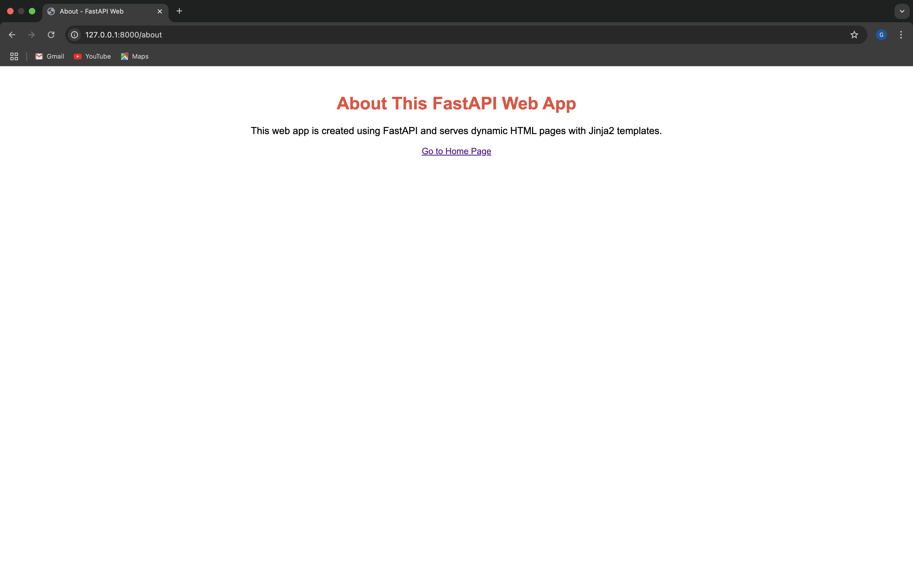

# 🚀 Tutorial: Membuat Aplikasi FastAPI dengan Web Interface dan Docker

Tutorial ini akan membawa Anda melalui langkah-langkah untuk membuat aplikasi **FastAPI** dengan **web interface** menggunakan **Jinja2** dan menjalankannya di dalam **Docker container**. Anda akan belajar bagaimana membuat halaman web menggunakan template HTML, merender halaman dengan FastAPI, dan mengemas aplikasi menggunakan Docker.

---

### 📁 Langkah 1: Membuat Folder Proyek

1. **Buka terminal** dan buat folder untuk proyek FastAPI Anda:

   ```bash
   mkdir tugas-docker
   cd tugas-docker
   ```

2. **Verifikasi folder telah dibuat**:

   ```bash
   ls
   ```

   Gambar folder yang dibuat:
   
   

---

### 📝 Langkah 2: Membuat File `main.py`

1. **Buka terminal** dan buat file `main.py` menggunakan **nano**:

   ```bash
   nano main.py
   ```

2. **Buka `main.py`** dan tambahkan kode berikut untuk menginisialisasi aplikasi FastAPI serta menyiapkan halaman web menggunakan **Jinja2**:

   ```python
   from fastapi import FastAPI
   from fastapi.templating import Jinja2Templates
   from starlette.responses import HTMLResponse
   from starlette.requests import Request

   # Inisialisasi FastAPI dan Jinja2Templates
   app = FastAPI()
   templates = Jinja2Templates(directory="templates")

   # Endpoint untuk halaman utama (Home)
   @app.get("/", response_class=HTMLResponse)
   def read_root(request: Request):
       return templates.TemplateResponse("home.html", {"request": request})

   # Endpoint untuk halaman about
   @app.get("/about", response_class=HTMLResponse)
   def about(request: Request):
       return templates.TemplateResponse("about.html", {"request": request})
   ```

3. **Simpan dan keluar** dari **nano**:
   - Tekan `Ctrl + O` untuk menyimpan file.
   - Tekan `Enter` untuk mengonfirmasi nama file.
   - Tekan `Ctrl + X` untuk keluar dari **nano**.

   Gambar kode dalam `main.py` yang dibuka dengan nano:
   
   
   
---

### 🌐 Langkah 3: Menyiapkan Struktur Folder Template

1. **Buat folder `templates/`** untuk menyimpan file HTML:

   ```bash
   mkdir templates
   ```

2. **Buat file `home.html`** di dalam folder `templates/`:

   ```bash
   touch templates/home.html
   ```

3. **Buka file `home.html`** dengan **nano** untuk mengeditnya:

   ```bash
   nano templates/home.html
   ```

4. **Isi `home.html`** dengan HTML berikut:

   ```html
   <!DOCTYPE html>
   <html lang="en">
   <head>
       <meta charset="UTF-8">
       <meta name="viewport" content="width=device-width, initial-scale=1.0">
       <title>Welcome to FastAPI Web</title>
       <style>
           body {
               font-family: Arial, sans-serif;
               text-align: center;
               margin-top: 50px;
           }
           h1 {
               color: #3498db;
           }
           p {
               font-size: 18px;
           }
       </style>
   </head>
   <body>
       <h1>Welcome to FastAPI Web!</h1>
       <p>This is a simple web app served by FastAPI.</p>
       <a href="/about">Go to About Page</a>
   </body>
   </html>
   ```

5. **Simpan dan keluar** dari **nano**:
   - Tekan `Ctrl + O` untuk menyimpan file.
   - Tekan `Enter` untuk mengonfirmasi nama file.
   - Tekan `Ctrl + X` untuk keluar dari **nano**.

   Gambar file `home.html` setelah selesai diubah:

   

6. **Buat file `about.html`** untuk halaman "About" di dalam folder `templates/`:

   ```bash
   touch templates/about.html
   ```

7. **Buka file `about.html`** dengan **nano** untuk mengeditnya:

   ```bash
   nano templates/about.html
   ```

8. **Isi `about.html`** dengan HTML berikut:

   ```html
   <!DOCTYPE html>
   <html lang="en">
   <head>
       <meta charset="UTF-8">
       <meta name="viewport" content="width=device-width, initial-scale=1.0">
       <title>About - FastAPI Web</title>
       <style>
           body {
               font-family: Arial, sans-serif;
               text-align: center;
               margin-top: 50px;
           }
           h1 {
               color: #e74c3c;
           }
           p {
               font-size: 18px;
           }
       </style>
   </head>
   <body>
       <h1>About This FastAPI Web App</h1>
       <p>This web app is created using FastAPI and serves dynamic HTML pages with Jinja2 templates.</p>
       <a href="/">Go to Home Page</a>
   </body>
   </html>
   ```

9. **Simpan dan keluar** dari **nano**.

   Gambar file `about.html` setelah selesai diubah:

   

Dengan langkah ini, Anda telah berhasil menyiapkan folder `templates/` dan membuat file template HTML untuk halaman utama dan halaman about. Anda sekarang siap untuk menjalankan aplikasi FastAPI!

---

### 🚀 Langkah 4: Menjalankan Aplikasi FastAPI

1. **Install FastAPI, Uvicorn, dan Jinja2**:

   ```bash
   pip install fastapi uvicorn jinja2
   ```

   Gambar instalasi dependensi:
   
   

2. **Jalankan aplikasi FastAPI** dengan perintah berikut:

   ```bash
   uvicorn main:app --reload
   ```

   Gambar aplikasi berjalan:
   
   

---

### 🌐 Langkah 5: Akses Aplikasi di Browser

1. **Buka browser** dan akses aplikasi di alamat berikut:

   - **Halaman Utama**:
     ```text
     http://127.0.0.1:8000/
     ```

     Gambar halaman utama di browser:
     
     

   - **Halaman About**:
     ```text
     http://127.0.0.1:8000/about
     ```

     Gambar halaman about di browser:
     
     

---

### 🐳 Langkah 6: Menambahkan Docker untuk Menjalankan Aplikasi

1. **Buat file `Dockerfile`** untuk aplikasi FastAPI:

   ```bash
   touch Dockerfile
   ```

2. **Buka file `Dockerfile`** dengan **nano**:

   ```bash
   nano Dockerfile
   ```

3. **Isi `Dockerfile`** dengan kode berikut:

   ```dockerfile
   FROM python:3.9

   WORKDIR /app

   COPY . .

   RUN pip install --no-cache-dir -r requirements.txt

   CMD ["uvicorn", "main:app", "--host", "0.0.0.0", "--port", "8000"]
   ```

4. **Simpan dan keluar** dari **nano**:
   - Tekan `Ctrl + O` untuk menyimpan file.
   - Tekan `Enter` untuk mengonfirmasi nama file.
   - Tekan `Ctrl + X` untuk keluar dari **nano**.

   Gambar `Dockerfile` setelah selesai:

   

5. **Buat file `requirements.txt`** untuk menyimpan dependensi aplikasi:

   ```bash
   touch requirements.txt
   ```

6. **Buka file `requirements.txt`** dengan **nano**:

   ```bash
   nano requirements.txt
   ```

7. **Isi `requirements.txt`** dengan dependensi yang diperlukan:

   ```txt
   fastapi
   uvicorn
   jinja2
   ```

8. **Simpan dan keluar** dari **nano**:
   - Tekan `Ctrl + O` untuk menyimpan file.
   - Tekan `Enter` untuk mengonfirmasi nama file.
   - Tekan `Ctrl + X` untuk keluar dari **nano**.

   Gambar `requirements.txt` setelah selesai:

   

Dengan langkah ini, Anda telah berhasil menambahkan Dockerfile dan file `requirements.txt` yang diperlukan untuk menjalankan aplikasi FastAPI di dalam container Docker. Anda kini dapat melanjutkan dengan membangun dan menjalankan Docker container untuk aplikasi Anda!

### 🐳 Langkah 6: Menambahkan Docker untuk Menjalankan Aplikasi

1. **Buat file `Dockerfile`** untuk aplikasi FastAPI:

   ```bash
   touch Dockerfile
   ```

2. **Isi `Dockerfile`** dengan kode berikut:

   ```dockerfile
   FROM python:3.9

   WORKDIR /app

   COPY . .

   RUN pip install --no-cache-dir -r requirements.txt

   CMD ["uvicorn", "main:app", "--host", "0.0.0.0", "--port", "8000"]
   ```

   Gambar `Dockerfile`:
   
   

3. **Buat file `requirements.txt`** dan masukkan dependensi berikut:

   ```bash
   touch requirements.txt
   ```

   Isi `requirements.txt`:
   
   ```
   fastapi
   uvicorn
   jinja2
   ```

   Gambar `requirements.txt`:
   
   

---

### 📦 Langkah 7: Membangun Docker Image dan Menjalankan Container

1. **Bangun Docker image**:

   ```bash
   docker build -t fastapi-web-app .
   ```

   Gambar proses build Docker:
   
   

2. **Jalankan Docker container**:

   ```bash
   docker run -d -p 8000:8000 fastapi-web-app
   ```

   Gambar Docker container berjalan:
   
   

---

### 🌍 Langkah 8: Akses Aplikasi melalui Docker

1. **Buka browser** dan akses aplikasi yang berjalan di Docker di alamat berikut:

   ```text
   http://127.0.0.1:8000
   ```

   Gambar tampilan aplikasi di browser (dari Docker):
   
   

---

## 🎉 Selesai!

Selamat! Anda telah berhasil membuat aplikasi **FastAPI** dengan **web interface** menggunakan **Jinja2** dan menjalankannya di dalam **Docker container**. Anda sekarang dapat mengembangkan aplikasi lebih lanjut dengan menambahkan lebih banyak fitur atau tampilan sesuai kebutuhan.

---

## 📌 Referensi

- [Dokumentasi FastAPI](https://fastapi.tiangolo.com/)
- [Docker Documentation](https://docs.docker.com/)
- [Jinja2 Documentation](https://jinja.palletsprojects.com/)

---

### Penjelasan
- **Langkah-langkah**: Menjelaskan dari awal pembuatan proyek hingga aplikasi berjalan di browser dengan Docker.

Dengan langkah-langkah di atas, Anda bisa membuat aplikasi web menggunakan FastAPI dengan antarmuka pengguna yang dapat diakses melalui browser dan dikemas dengan Docker.

Berikut adalah penambahan untuk dokumentasi terkait **Fase Bedah Container** dan **Optimasi Resources** :

---

Berikut adalah lanjutan dari tutorial Anda dengan langkah-langkah terkait **Bedah Container**, serta **Optimasi Resources** dalam konteks aplikasi FastAPI yang berjalan dalam container Docker. Semua proses dilakukan melalui terminal, dan saya akan sertakan instruksi terkait screenshot pada setiap langkah.

# 📚 Tutorial: Bedah Container dan Optimasi Resources pada Docker untuk Aplikasi FastAPI

---

## 🔍 Langkah 1: Melihat Container yang Berjalan

Setelah Anda berhasil menjalankan aplikasi FastAPI dalam container, periksa container yang sedang berjalan dengan perintah:

```bash
docker ps
```

Outputnya akan menunjukkan daftar container yang aktif, seperti ini:

```
CONTAINER ID   IMAGE             COMMAND                  CREATED          STATUS          PORTS                    NAMES
ebf10abca6b6   fastapi-web-app   "uvicorn main:app --…"   20 minutes ago   Up 20 minutes   0.0.0.0:8000->8000/tcp   epic_johnson
```

Gambar output `docker ps`:


---

## 🛠️ Langkah 2: Mengakses Shell di dalam Container

Untuk melihat lebih dalam tentang container, Anda dapat masuk ke dalam container menggunakan perintah berikut:

```bash
docker exec -it epic_johnson /bin/bash
```

Ini akan membawa Anda ke dalam shell dari container yang bernama `epic_johnson`.

Gambar tampilan shell dalam container:


---

## 🗂️ Langkah 3: Bedah Struktur File dalam Container

Sekarang Anda berada di dalam shell container, Anda bisa menjalankan berbagai perintah untuk menjelajahi sistem file container. Misalnya, periksa direktori kerja container dengan perintah:

```bash
ls /app
```

Gambar hasil perintah `ls` di dalam container:


---

## 🖥️ Langkah 4: Memeriksa Sistem Operasi Container

Untuk melihat informasi sistem operasi yang digunakan dalam container, jalankan perintah:

```bash
cat /etc/os-release
```

Outputnya akan menunjukkan informasi tentang sistem operasi container, seperti ini:

```
NAME="Debian"
VERSION="10 (Buster)"
```

Gambar output perintah `cat /etc/os-release`:


---

## 🛠️ Langkah 5: Memeriksa Daftar Proses yang Berjalan dalam Container

Untuk melihat proses yang berjalan dalam container, gunakan perintah:

```bash
ps aux
```

Gambar daftar proses dalam container:


---

## ⚙️ Langkah 6: Melihat Resource yang Digunakan oleh Container

Untuk memonitor penggunaan sumber daya (CPU, memori, dll) dalam container, gunakan perintah:

```bash
docker stats epic_johnson
```

Outputnya akan menampilkan penggunaan resource, seperti berikut:

```
CONTAINER ID   NAME           CPU %     MEM USAGE / LIMIT     NET I/O       BLOCK I/O
ebf10abca6b6   epic_johnson   0.03%     15.3MiB / 2GiB        2.53kB / 0B   0B / 0B
```

Gambar output perintah `docker stats`:


---

## ⚡ Langkah 7: Optimasi Resources untuk Container

Untuk melakukan optimasi resource, Anda bisa mengatur batasan pada CPU dan memori yang digunakan oleh container saat menjalankan aplikasi. Berikut adalah cara untuk melakukan optimasi:

### 1. **Batasan Memori**

Saat menjalankan container, Anda bisa menggunakan opsi `--memory` untuk membatasi penggunaan memori, contohnya:

```bash
docker run -d -p 8000:8000 --memory="512m" fastapi-web-app
```

Perintah ini akan membatasi penggunaan memori container menjadi 512 MB.

Gambar output penggunaan memori:


### 2. **Batasan CPU**

Untuk membatasi CPU, Anda bisa menggunakan opsi `--cpus`, seperti berikut:

```bash
docker run -d -p 8000:8000 --cpus="1.0" fastapi-web-app
```

Perintah ini akan membatasi penggunaan CPU menjadi satu core.

Gambar pengaturan CPU:


---

## 🌍 Langkah 8: Mengakses Aplikasi Setelah Optimasi

Setelah optimasi resource, Anda bisa mengakses aplikasi FastAPI seperti sebelumnya melalui browser di alamat berikut:

```
http://127.0.0.1:8000
```

Gambar tampilan aplikasi di browser:


---

## 🎉 Selesai!

Selamat, Anda telah berhasil melakukan bedah container untuk aplikasi FastAPI Anda dan menerapkan optimasi resources untuk meningkatkan performa aplikasi Anda di dalam Docker container.

---

## 📌 Referensi

- [Docker Documentation](https://docs.docker.com/)
- [FastAPI Documentation](https://fastapi.tiangolo.com/)
- [Jinja2 Documentation](https://jinja.palletsprojects.com/)

```

### Penjelasan Tambahan:

- **Langkah-langkah Bedah Container**: Anda dapat memeriksa isi container dan berbagai informasi sistem menggunakan perintah seperti `docker ps`, `ls`, dan `cat /etc/os-release`.
- **Optimasi Resources**: Anda dapat mengoptimalkan penggunaan CPU dan memori container dengan menggunakan opsi `--memory` dan `--cpus` saat menjalankan container.
- **Screenshot**: Pada setiap langkah, Anda akan menyertakan screenshot yang sesuai, simpan gambar tersebut di folder `images` dengan nama yang sesuai dengan instruksi. 

Dokumentasi ini akan memberikan gambaran menyeluruh tentang cara berinteraksi dengan container dan mengoptimalkannya di Docker.
